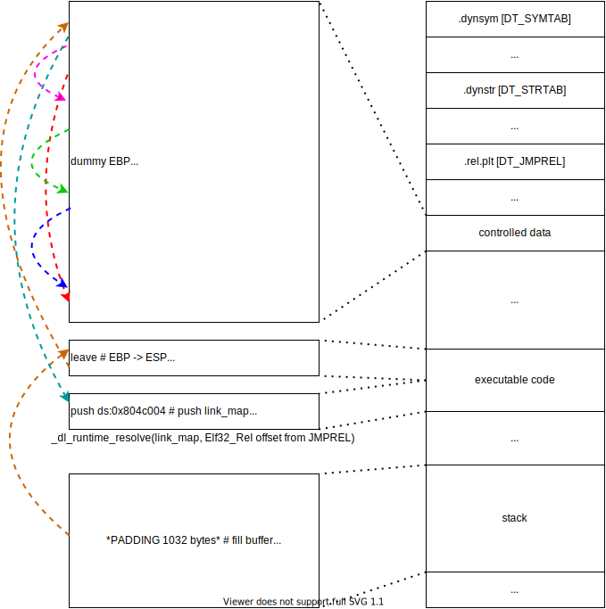

# bacon
ELF x86, no PIE, no canary, NX, minimal binary, no leak functions, buffer overflow for few bytes.
Solution is to stack pivot to known location (initial BOF is too small) and exploit ret2dlresolve.

# ret2dlresolve
[general info](https://gist.github.com/ricardo2197/8c7f6f5b8950ed6771c1cd3a116f7e62)

[other ret2dlresolve writeup 1](https://www.da.vidbuchanan.co.uk/blog/0CTF-2018-babystack-ret2dlresolve.html)

[other ret2dlresolve writeup 2](https://kileak.github.io/ctf/2018/0ctf-qual-babystack/)

[other ret2dlresolve writeup 3 chinese](http://rk700.github.io/2015/08/09/return-to-dl-resolve/)

[other ret2dlresolve writeup 4 chinese](http://pwn4.fun/2016/11/09/Return-to-dl-resolve/)

[other ret2dlresolve writeup 5 (x64) chinese](http://inaz2.hatenablog.com/entry/2014/07/27/205322)

# solution
[exploit](./xpl.py)

## visualization 

