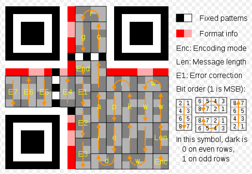

# shredded

## Description

In this task We got 27 images files (`0.png` - `26.png`) each of them was of size `10 x 297 px`, six of these images were blank (entirely white). Below You can see horizontal concatenation of all files except the blank ones:


So it looks like shredded QR code. The two margins, at the top and the bottom are both `30 px` tall, so I thought that the six blank images are the left and the right margins of QR code.

Checking all permutations of 21 images was unreal, so it was necessary to define a restrictions for each image as to on which position in final QR code they can be placed. I found the following image on [QR code wikipedia page](https://en.wikipedia.org/wiki/QR_code):



## Solution

I've created list of possible positions for each image basing on fixed patterns presented in above image (except of the single black square below the E4 sector, because I already had about 14 000 possible solutions and it wasn't worth to further reduce this number).

From all images (`0.png` - `26.png`) I removed six blank images and I "squeezed" names of the rest of images to have continuous name space (`1.png` - `21.png`). Six blank images were preset on three leftmost an three rightmost positions in the final image. Below We can see the set of possible positions for each node. Position 0 is the first position on the right side of the left margin, and position 20 is the last image before the right margin.

```
1.png  -> [15, 19]
2.png  -> [2, 3, 4]
3.png  -> [7]
4.png  -> [16, 17, 18, 8, 10, 12]
5.png  -> [0]
6.png  -> [1, 5]
7.png  -> [13]
8.png  -> [14, 20]
9.png  -> [9, 11]
10.png -> [14, 20]
11.png -> [1, 5]
12.png -> [2, 3, 4]
13.png -> [15, 19]
14.png -> [9, 11]
15.png -> [8, 10, 12]
16.png -> [8, 10, 12]
17.png -> [16, 17, 18, 8, 10, 12]
18.png -> [16, 17, 18, 8, 10, 12]
19.png -> [16, 17, 18, 8, 10, 12]
20.png -> [2, 3, 4]
21.png -> [6]
```

The last step was to generate and verify each possible QR code using Python script. Few of tested combinations produced the flag. Here is one of them:


> GOOD JOB. FLAG-80AD8BCF79

[shredded.py](../shredded.py) - Python script that automates the above steps.