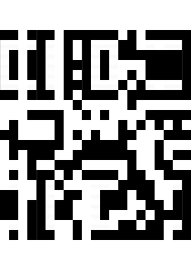
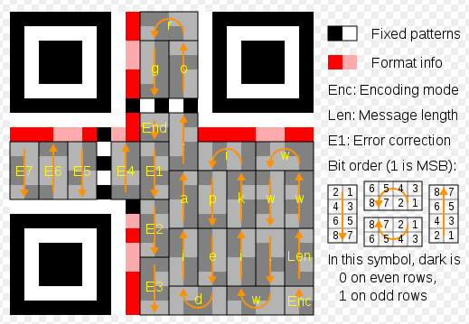

# SquareCTF 2018

November 8th-14th

Writeups by elklepo from **!soBad** CTF team.

## dot-n-dash

In this task we got:

* `dot-n-dash.html` which is both interface and engine for offline (does not have to be run in dedicated environment) string encoding and decoding without any key.
* `instructions.txt` file containing encoded data.

The whole `instructions.txt` file looks as follows:

> -----------------------------------------------------------------------------------------------------------------------------------------------------------------------------------------------------------------------------------------------------------------------------------------------------------------------------------------------------------------------------------------------------------------------------------------------------------------------------------------------------------------------------------------------------------------------------------------------------------------------------------------------------------------------------------.----------------------------------------------------------------------------------------------------------------------------------------------------------------------------------------------------------------------------------------------------------------------------------------------------------------------------------------------------------------------------------------------------------------------------------------------------------------------------------------------------------------------------------------------------------------------------------------------------------------------------------------------------------------------------------------------------------------------------------------------------------------------------------------------------------------------------------------------------.------------------------------  (...) about 370.000 more dots and dashes.

The most important parts of given code are methods responsible for string encoding and decoding:

```js
function _encode(input) {
    var a=[];
    for (var i=0; i<input.length; i++) {
        var t = input.charCodeAt(i);
        for (var j=0; j<8; j++) {
            if ((t >> j) & 1) {
                a.push(1 + j + (input.length - 1 - i) * 8);
            }
        }
    }

    var b = [];
    while (a.length) {
        var t = (Math.random() * a.length)|0;
        b.push(a[t]);
        a = a.slice(0, t).concat(a.slice(t+1));
    }

    var r = '';
    while (b.length) {
        var t = b.pop();
        r = r + "-".repeat(t) + ".";
    }
    return r;
}
// Everything below this line was lost due to cosmis radiation. The engineer who knows
// where the backups are stored already left.
function _decode(input) {
    return "";
}
```

So as We can see, our job is to write the body of `_decode()` method, and to do so We've to understand how encoding is done. Lets start analyzing the `_encode()` method by looking at the first loop:

```js
var a=[];
for (var i=0; i<input.length; i++) {
    var t = input.charCodeAt(i);
    for (var j=0; j<8; j++) {
        if ((t >> j) & 1) {
            a.push(1 + j + (input.length - 1 - i) * 8);
        }
    }
}
```

As We can see, the outer loop iterates through every char (`t`) in input string (`i` holds its index), the second loop iterates through every bit in given char (`j` holds its position). The `if` statement is executed only if `j` bit is set in char `t`. In the `if` statement the list `a` is extended with single number. Lets look at the expression that defines the number value from right to left:

* `(input.length - 1 - i) * 8` We can also write as `(input.length - 1 - i) << 3` so we can clearly see that three least significant bits of the resulting number will be unset. `input.length` is constant for each char in given input string, so that value of this subexpression will have smaller value for char at index `i` than for char at index `i - 1`.
* `j` is added to expression mentioned above, its value is from range $\langle0; 2^3)$ so it will be written at three least significant bits.
*  At the end, the value is incremented by one.

So every number added to list `a`, after decrementing its value by one, holds the information about:

* set bit position in given char (at three least significant bits) - `bit_pos = (a[x] - 1) & 0x7`
* relative char position in input string (at the rest of bits) - `char_pos = (a[x] - 1) >> 3`. `char_pos` for the first char will have the smallest value and `char_pos` for last char will have the biggest value.

Summing up, this loop is responsible for adding a single number to list `a` for each set bit in every char in input string. Moreover, We can recover the relative position of char that this set bit belongs to and position of this set bit in char.

Next loop in `_encode()` method is only responsible for shuffling the list `a`:

```js
var b = [];
while (a.length) {
	var t = (Math.random() * a.length)|0;
    b.push(a[t]);
    a = a.slice(0, t).concat(a.slice(t+1));
}
```

After this loop finishes its work, `b` list is just shuffled form of `a` list. Lets look at the last code block in `_encode()` method:

```js
var r = '';
while (b.length) {
    var t = b.pop();
    r = r + "-".repeat(t) + ".";
}
return r;
```

This loop creates the final encoded string. For each number in `b` it adds number of dashes equal to value of currently processed number and single dot afterwards.

### Solution

We can easily recover the `b` list just by counting the dashes till the firs occurrence of dot in encoded string and repeat this process until the end of encoded string read from `instructions.txt`.

We're unable to recover the `a` array without exploiting the `Math.random()`. But We don't have to, because each number in `b` holds all required information and recovering the initial number position in `a` is not necessary.

For each number in `b`, which represents single set bit in particular char, let's define:

```python
char_pos = (n - 1) >> 3
bit_pos = (n - 1) & 0x7
```

Then, We have to aggregate all numbers with the same `char_pos` and create corresponding char with value `0x00`. For each aggregated number, bit at `bit_pos` related to this number should be set in created char. 

Once all chars are constructed, We've to simply print them form the biggest value of corresponding `char_pos` to the smallest one:

>Instructions to disable C1: 
>1. Open the control panel in building INM035. 
>2. Hit the off switch. 
>
>Congrats, you solved C1! The flag is flag-bd38908e375c643d03c6.

Voilà!

`dot-n-dash.py` - Python script that automates the above steps.

## shredded

In this task We got 27 images files (`0.png` - `26.png`) each of them was of size `10 x 297 px`, six of these images were blank (entirely white). Below You can see horizontal concatenation of all files except the blank ones:



So it looks like shredded QR code. The two margins, at the top and the bottom are both `30 px` tall, so I thought that the six blank images are the left and the right margins of QR code.

Checking all permutations of 21 images was unreal, so it was necessary to define a restrictions for each image as to on which position in final QR code they can be placed. I found the following image on [QR code wikipedia page](https://en.wikipedia.org/wiki/QR_code):



### Solution

I've created list of possible positions for each image basing on fixed patterns presented in above image (except of the single black square below the E4 sector, because I already had about 14 000 possible solutions and it wasn't worth to further reduce this number).

From all images (`0.png` - `26.png`) I removed six blank images and I "squeezed" names of the rest of images to have continuous name space (`1.png` - `21.png`). Six blank images were preset on three leftmost an three rightmost positions in the final image. Below We can see the set of possible positions for each node. Position 0 is the first position on the right side of the left margin, and position 20 is the last image before the right margin.

```
1.png  -> [15, 19]
2.png  -> [2, 3, 4]
3.png  -> [7]
4.png  -> [16, 17, 18, 8, 10, 12]
5.png  -> [0]
6.png  -> [1, 5]
7.png  -> [13]
8.png  -> [14, 20]
9.png  -> [9, 11]
10.png -> [14, 20]
11.png -> [1, 5]
12.png -> [2, 3, 4]
13.png -> [15, 19]
14.png -> [9, 11]
15.png -> [8, 10, 12]
16.png -> [8, 10, 12]
17.png -> [16, 17, 18, 8, 10, 12]
18.png -> [16, 17, 18, 8, 10, 12]
19.png -> [16, 17, 18, 8, 10, 12]
20.png -> [2, 3, 4]
21.png -> [6]
```

The last step was to generate and verify each possible QR code using Python script. Few of tested combinations produced the flag. Here is one of them:


> GOOD JOB. FLAG-80AD8BCF79

Voilà!

`shredded.py` - Python script that automates the above steps.


## de-anonymization

## gates of hell

## captcha

## fixed point

In this task We got `fixed_point.html` that served as an interface and engine for solving this task, the flag was of course removed from this file. We also had access to `fixed_point.html` hosted in remote server to obtain the real flag one We find out how to do this in local environment.

The code was very simple:

```js
function f(x) {
  if ((x.substr(0, 2) == '🚀') && (x.slice(-2) == '🚀')) {
    return x.slice(2, -2);
  }
  if (x.substr(0, 2) == '👽') {
    return '🚀' + f(x.slice(2));
  }
  if (x.substr(0, 2) == '📡') {
    return f(x.slice(2)).match(/..|/g).reverse().join("");
  }
  if (x.substr(0, 2) == '🌗') {
    return f(x.slice(2)).repeat(5);
  }
  if (x.substr(0, 2) == '🌓') {
    var t = f(x.slice(2));
    return t.substr(0, t.length/2);
  }
  return "";
}
```

The rest of `fixed_point.html` was responsible for collecting input and validating it. Below is the condition that had to be met to obtain the flag:

```js
function check() {
  var i = input.value.replace(/\s/g, '');
  if (i == "") {
    result.innerText = "";
  } else {
    var t = f(i);
    if (t == i) {
      result.innerText = "good!"; //flag on remote server
    } else {
      result.innerText = "bad! (" + t + " != " + i + ")";
    }
  }
}
```

As We can see, the condition is also very simple  `input == f(input)`.

### Solution

The first thing I did was rewrite this code to Python and brute force it, I've managed to test all combinations on input with length $\langle1; 12\rangle$ but it finished with no solution, the input must've been longer so I've started manual input construction. After some time, I approached the strategy, which can be shortened to the following bullets:

* The right side of the input is constructed in form - 🚀...`payload`...🚀. The output will be constructed only form `payload` elements.
* The left side of the input is combination of 🌓 and 🌗 (lets call it `header`). By changing the number and positions of those two moons I was able to change the length and the structure of output which was constructed from `payload`.
* Number of 📡 are added in `header`, somewhere between 🌓 and 🌗. The point of this is to manipulate the structure of output, and to change the length of input without changing the length of the output.
* The length of the `payload` must be the multiple of `header` length incremented by one. This concept allowed to easily match the two 🚀that surround the `payload`  (both  🚀 were covered in output by the same element form multiplied `payload`).

After defining this strategy in my mind I Was finally able to find the valid input:

🌓📡📡📡🌓🌗🚀🚀👽👽👽👽👽👽👽🚀🚀🌗🌓📡📡📡🌓👽👽👽👽👽👽👽👽👽🌓📡📡📡🌓🌗🚀🚀

> good! flag-2d4584368d09da2187f5

Voilà!